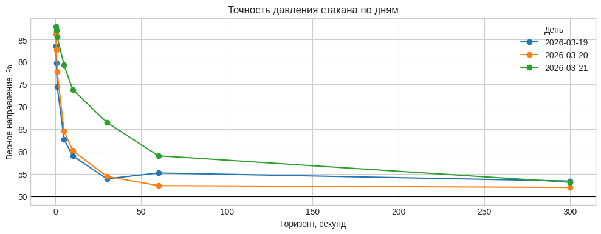
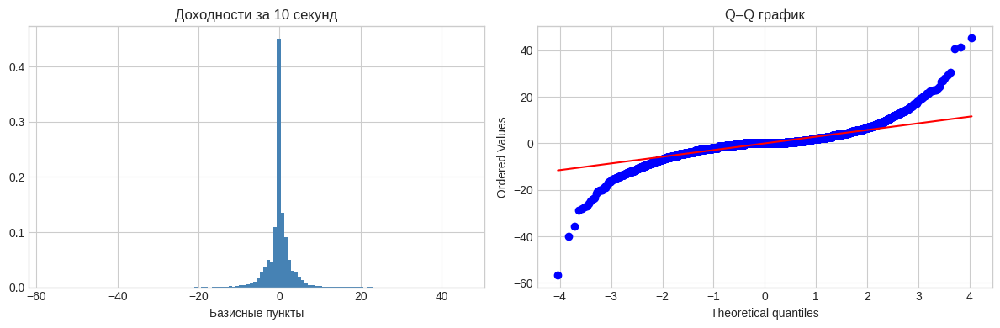

# ETH Perpetual Strategy Backtester

This project compares two simple strategies on ETH perpetual-futures data from 2026-03-19 through 2026-03-21: an inventory-aware market maker and a seeded coin-flip benchmark. It is a research backtest, not a production trading system.

Both strategies lose money in the tested period even with zero fees and zero artificial latency. Historical execution is the largest source of uncertainty, especially when a resting order is crossed by a later order-book snapshot.

## Run on the server

Remote users authenticate with a password. Connect first, enter the password sent separately by email when SSH prompts for it, and then launch the menu:

```bash
ssh general@188.166.0.52
cd /home/general/hft
./run.sh
```

## Backtest results

| Strategy | Total P&L | Turnover | Max drawdown | Max inventory | Maker / taker fills |
|---|---:|---:|---:|---:|---:|
| Market maker | -91.41 USD | 370,460 USD | -92.56 USD | 1.215 ETH | 1,806 / 38 |
| Coin flip (seed 42) | -93.61 USD | 358,727 USD | -124.04 USD | 2.000 ETH | 1,748 / 304 |

Both runs finish with zero inventory and no material inventory-limit breach. The strict execution model cancels, rather than fills, resting orders crossed by a later book snapshot: 25,367 for the market maker and 37,362 for the coin flip. This avoids claiming unprovable fills but is optimistic about adverse selection, so the cancellation counts must be read alongside P&L.

## Strategy 1: market maker

The strategy reviews quotes every 300 ms and uses the first five book levels. Book pressure is

$$
I_t = \frac{\sum_{l=1}^{5} V^{bid}_{t,l} - \sum_{l=1}^{5} V^{ask}_{t,l}}
{\sum_{l=1}^{5} V^{bid}_{t,l} + \sum_{l=1}^{5} V^{ask}_{t,l}}.
$$

Let $b_t$, $a_t$, $m_t=(b_t+a_t)/2$, and $s_t=a_t-b_t$ be the best bid, best ask, mid-price, and spread. With tick size $\tau=0.10$ USD, inventory $q_t$, target $q_t^*$, and current limit $L_t$, the strategy computes

$$
z_t = \operatorname{clip}\!\left(\frac{q_t-q_t^*}{\max(L_t,0.1)},-1,1\right),
\qquad
c_t = m_t + I_t\tau - 3z_t\tau,
$$

$$
p_t^{bid} = \min\!\left(\lfloor c_t-s_t/2-\tau \rfloor_{\tau}, b_t\right),
\qquad
p_t^{ask} = \max\!\left(\lceil c_t+s_t/2+\tau \rceil_{\tau}, a_t\right).
$$

It posts at most one 0.1 ETH order per side. Pressure shifts the quote center by at most one tick; inventory shifts it by at most three ticks. The best opposite price caps each quote, so a new quote never crosses the spread.

Before the final day, funding sets the preferred inventory:

$$
q_t^* = \operatorname{clip}\!\left(-\frac{f_t}{10^{-4}}\times0.1,-0.25,0.25\right) \text{ ETH}.
$$

On the final day, the target decays linearly from the inventory held at 00:00 to zero. The strategy also removes the bid when inventory is above target and removes the ask when it is below target, so quotes help liquidation rather than oppose it.

## Strategy 2: coin flip

At each 300 ms decision, a fair seeded coin selects exactly one resting maker quote:

$$
X_t\sim\operatorname{Bernoulli}(1/2),
\qquad
X_t=0:\ (p_t,size)=(b_t,0.1\text{ ETH}),
\qquad
X_t=1:\ (p_t,size)=(a_t,0.1\text{ ETH}).
$$

The coin flip has no pressure, inventory, or funding signal; its inventory target is zero. It uses the same execution, accounting, and risk controls as the market maker. The seed is printed and saved in `manifest.json`; seed 42 reproduces the reported run.

## Shared inventory management

The absolute inventory limit is 2 ETH on the first two days. It shrinks linearly to zero during the final day:

$$
L_t =
\begin{cases}
2, & t < \text{2026-03-21},\\
2(1-u_t), & t \in \text{2026-03-21},
\end{cases}
$$

where $u_t$ is the fraction of the final day already elapsed. The limit includes current inventory and the remaining size of active orders. Unsafe resting orders are cancelled, new sizes are clipped to available capacity, excess inventory caused by the shrinking limit is reduced with a taker order, and any remaining position is closed at the end.

Funding cash flow is applied every eight hours as $\Delta C_t=-q_t m_t f_t$. Portfolio accounting continuously checks

$$
\text{equity}=\text{cash}+q_t m_t
=\text{realized P\&L}+\text{unrealized P\&L}+\text{funding P\&L}-\text{fees}.
$$

## Jupyter notebook results

The executed notebook [`notebooks/01_hft_eda.ipynb`](notebooks/01_hft_eda.ipynb) analyzes 3,581,577 order-book rows, 70,556 trades, and 12,902 funding updates. It finds no missing values and no zero or negative spreads.

### Book pressure



On the held-out third day, pressure predicts the direction of a non-zero 0.3-second move 87.9% of the time. However, only 2.69% of those intervals move and the return-size $R^2$ is -7.04%. The advantage fades with horizon, which is why pressure is used only as a one-tick quote adjustment.

### Returns are not normally distributed



The histogram is sharply peaked and the Q-Q tails depart strongly from the normal reference line. The notebook tests report:

| Test | Statistic | p-value | Conclusion at 5% |
|---|---:|---:|---|
| ADF, log price | -2.430 | 0.1333 | Price level is non-stationary |
| ADF, 10-second returns | -37.239 | reported as 0 | Returns are stationary |
| Jarque-Bera, returns | 371,682.7 | reported as 0 | Returns are not normal; kurtosis is 21.55 |
| Jarque-Bera, log trade size | 2,549.9 | reported as 0 | Trade sizes are not lognormal |
| ARCH, returns | 4,979.4 | reported as 0 | Volatility changes over time |

Average annualized funding is -5.18%, -6.84%, and +6.65% on the three respective days. Its sign change supports keeping funding P&L separate from trading P&L.

## Execution model

- Events with the same timestamp are processed as one batch; a new order cannot fill from its creation event.
- Maker fills use trade aggressor direction and displayed volume ahead at the quoted price. A trade through the price fills the remaining order.
- Unknown depth beyond the retained 20 levels is treated as an unknown queue, not an empty queue.
- Stale books cancel quotes. Snapshot-crossed orders are cancelled under the strict policy because the snapshot alone does not prove a fill.
- Taker liquidations consume visible depth level by level.

## Local use

Python 3.12 is supported. The raw dataset and generated backtest outputs are excluded from Git; place the Parquet files at the path described in [`DATA.md`](DATA.md).

```bash
./run.sh --setup
./run.sh
```

Useful non-interactive commands are:

```bash
./run.sh --list
./run.sh --run market_maker
./run.sh --run coin_flip
./run.sh --run-all
./run.sh --test
./run.sh --jupyter
```

For a reproducible coin-flip run, use `./run.sh --run coin_flip`, enter `42` when prompted, or call `run_backtest.py --config config/coin_flip.yaml --seed 42` directly.

Each run writes `metrics.json`, `daily_metrics.csv`, `fills.csv`, `monitoring.parquet`, `summary.png`, and `manifest.json` under `outputs/PROFILE/`.

## Project layout

```text
config/             Strategy and simulator parameters
market_maker/       Strategy, risk, execution, accounting, and reporting code
tests/              Deterministic handwritten event streams
notebooks/          Executed exploratory analysis
docs/images/        Selected plots exported from the notebook
run.sh              Primary interactive and command-line entry point
run_backtest.py     Lower-level Python entry point
```

The original task constraints are in [`REQUIREMENTS.md`](REQUIREMENTS.md), and data provenance is in [`DATA.md`](DATA.md).

## Known limitations

- Only three days of one market are available.
- Fees and placement/cancellation latency are set to zero.
- Queue position is inferred from snapshots and trades, not exchange order IDs.
- Snapshot-crossed orders have no provable historical outcome.
- This is a single-process historical simulator with no live exchange connectivity.
